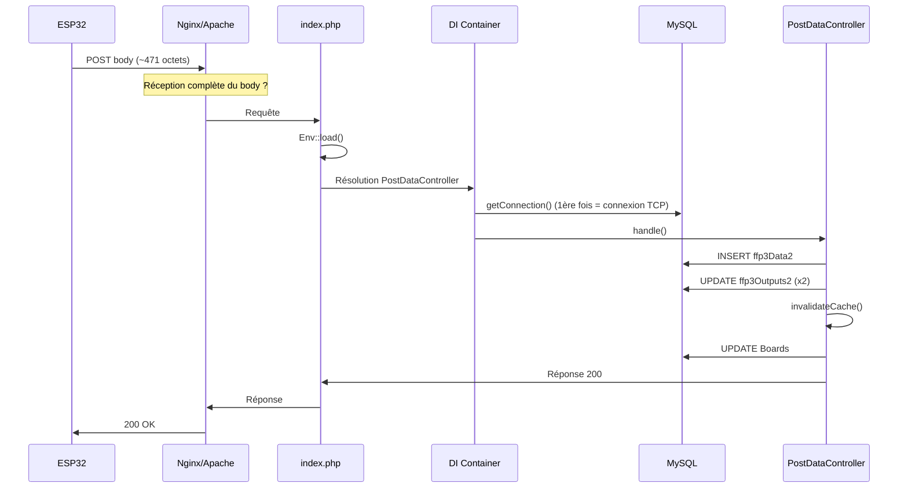

# Analyse code serveur (ffp3) – causes possibles de latence POST

**Contexte :** POST depuis l’ESP32 vers `/post-data-test` dure ~18–21 s côté client ; depuis un PC (curl) le même serveur répond en < 0,2 s. Cette note analyse le code serveur pour identifier ce qui pourrait expliquer une telle latence.

---

## 1. Parcours du code pour un POST valide

---

## 2. Ce qui est exécuté (et mesuré par l’instrumentation)

L’instrumentation dans `PostDataController::handle()` mesure le temps entre le début du `try` et la fin de `updateLastRequest` :

| Étape | Fichier / méthode | Opération |
|-------|-------------------|-----------|
| insert | `SensorRepository::insert()` | 1 × `INSERT` dans `ffp3Data2` |
| sync   | `OutputRepository::syncStatesFromSensorData()` | 2 × `UPDATE` sur `ffp3Outputs2` (nourrissage 108/109, puis reste) |
| cache  | `OutputCacheService::invalidateCache()` | `unset` de tableaux statiques (mémoire) |
| board  | `BoardRepository::updateLastRequest()` | 1 × `UPDATE Boards SET last_request = …` |

Aucun `sleep()`, boucle longue, appel HTTP externe ou N+1 dans ce chemin. Les requêtes SQL sont simples et en nombre fixe (4 au total).

---

## 3. Ce qui n’est **pas** dans la fenêtre mesurée

La latence perçue par l’ESP32 peut venir d’avant ou après le bloc instrumenté :

- **Avant le bloc (avant `$t0`)**  
  - Réception du body par le serveur web : si l’ESP32 envoie le corps très lentement (WiFi, buffer TCP), Nginx/Apache n’invoquent PHP qu’une fois le body complet reçu. Ces secondes ne sont pas vues par notre `timing_ms`.  
  - Connexion MySQL : au premier appel, le container résout `PDO::class` → `Database::getConnection()`. La connexion TCP vers MySQL (et éventuellement résolution DNS de `DB_HOST`) a lieu à ce moment-là, **avant** l’entrée dans `handle()`. Si la BDD est distante ou le DNS lent, ce délai peut être important mais reste en général bien en dessous de 18 s.  
  - Parsing du body et validation (clé API, champs) : exécution légère, peu susceptible d’expliquer 18 s à elle seule.

- **Après le bloc (après `$t4`)**  
  - Écriture du log : `LogService::info()` écrit dans un fichier (ex. `cronlog.txt`). Si ce fichier est sur un disque lent ou NFS bloquant, l’écriture peut retarder l’envoi de la réponse.  
  - Envoi de la réponse par le serveur web vers l’ESP32 : chemin réseau sortant.

---

## 4. Pistes de cause côté serveur (code / config)

### 4.1 Connexion MySQL (avant `$t0`)

- **Où :** `config/dependencies.php` → `PDO::class` → `Database::getConnection()`, appelé lors de la résolution de `PostDataController` (donc avant `handle()`).  
- **Risque :** si `DB_HOST` est un nom d’hôte et que la résolution DNS est lente ou bloquante, ou si MySQL est distant, la première requête du worker peut subir ce délai.  
- **Vérification :** dans les logs, si `timing_ms total` est faible (ex. < 500 ms) alors que l’ESP32 mesure 18 s, une partie importante de la latence est en amont (connexion, réception du body, etc.).  
- **Piste :** utiliser une IP pour `DB_HOST` si le DNS est lent ; garder MySQL sur la même machine ou un lien à faible latence.

### 4.2 Contention / locks MySQL (pendant insert ou sync)

- **Où :** `SensorRepository::insert()` et `OutputRepository::batchUpdateStatesSingleQuery()` (×2).  
- **Risque :** un autre processus (cron, autre script) qui garde un lock sur `ffp3Data2` ou `ffp3Outputs2` peut bloquer l’INSERT ou les UPDATE pendant plusieurs secondes.  
- **Vérification :** si les logs montrent `insert_ms` ou `sync_ms` très élevés (plusieurs secondes), investiguer les requêtes longues et les crons qui touchent ces tables.  
- **Piste :** éviter les crons qui font des UPDATE/INSERT longs sur les mêmes tables en parallèle du POST ; vérifier les index (voir ci‑dessous).

### 4.3 Index et performance des UPDATE

- **Où :** `OutputRepository::batchUpdateStatesSingleQuery()` — `WHERE gpio IN (...)` et conditions sur `lastModifiedBy` / `requestTime`.  
- **État :** une migration prévoit `idx_lastModifiedBy_requestTime` sur `ffp3Outputs` / `ffp3Outputs2`. Les tables sont petites (quelques dizaines de lignes). En conditions normales, même un full scan resterait sous la seconde.  
- **Risque :** si la table grossissait ou si l’index manquait sur un environnement, des UPDATE pourraient ralentir. Peu probable comme seule cause de 18 s.

### 4.4 Écriture du fichier de log (après `$t4`)

- **Où :** `LogService::info()` après le bloc mesuré, écriture dans le fichier défini par `LOG_FILE_PATH` ou `cronlog.txt`.  
- **Risque :** si le fichier est sur NFS ou un disque très chargé, l’écriture peut bloquer et retarder l’envoi de la réponse.  
- **Vérification :** si `total` dans les logs est faible mais que le client attend longtemps, comparer avec un test où on désactive temporairement le log après POST.  
- **Piste :** s’assurer que le fichier de log est sur disque local et si possible pas sur un point de montage bloquant.

### 4.5 Réception lente du body (côté serveur web)

- **Où :** entre l’arrivée de la requête et l’appel à PHP. Le serveur web ne transmet généralement la requête à PHP qu’une fois le body entièrement reçu (ou au moins bufférisé).  
- **Risque :** si l’ESP32 envoie les ~471 octets très lentement (WiFi instable, petit buffer, retransmissions TCP), le serveur attend longtemps avant d’appeler PHP. Du point de vue du code PHP, la requête “met 18 s à arriver”.  
- **Vérification :** les logs serveur avec `timing_ms` : si `total` est faible, la lenteur est en amont de `handle()` (réception du body ou connexion BDD). Côté firmware, mesurer le temps jusqu’au premier octet envoyé et la bande passante upload.  
- **Piste :** diagnostic réseau / WiFi côté ESP32 ; éventuellement vérifier les timeouts et buffers du serveur web pour les requêtes POST.

---

## 5. Synthèse

- Le **code PHP** du chemin POST (insert → sync → cache → board) est simple, sans opération intrinsèquement lente (pas de sleep, pas d’appel réseau, peu de requêtes SQL). Une latence de 18 s due uniquement à ce bloc serait très atypique.  
- Les causes les plus plausibles côté “serveur” au sens large sont :  
  1. **Temps de réception du body** par le serveur web (upload lent depuis l’ESP32).  
  2. **Connexion MySQL** au premier hit du worker (DNS ou BDD distante).  
  3. **Contention MySQL** (locks) sur les tables Data/Outputs.  
  4. **Écriture du log** sur un disque/NFS lent.  

L’instrumentation déjà en place (`timing_ms: insert, sync, cache, board, total`) permet de trancher :  
- **total faible (< 1 s)** → la latence est en amont (réseau, réception du body, connexion BDD) ou après (log, envoi réponse).  
- **total ou une étape (insert/sync) élevé** → cibler la BDD (locks, index, charge) ou le disque (log).

---

## 6. Mesure côté firmware

La durée affichée par l’ESP32 (`[HTTP] Requête: X ms`) couvre tout le round-trip (début de `httpRequest()` à la fin, inclut DNS, TCP, envoi, réception). Le détail (fichier, interprétation, test curl depuis le même WiFi, RSSI) est dans [TESTS_LATENCE_SERVEUR_DISTANT.md](TESTS_LATENCE_SERVEUR_DISTANT.md) sections 7, 8 et 9.

---

## 7. Fichiers concernés

| Fichier | Rôle |
|---------|------|
| `ffp3/public/index.php` | Point d’entrée ; Env::load() ; routes ; middleware (EnvironmentMiddleware pour /post-data-test). |
| `ffp3/config/dependencies.php` | Résolution PDO → `Database::getConnection()` (connexion au premier usage). |
| `ffp3/src/Controller/PostDataController.php` | Validation, insert, sync, cache, board, instrumentation. |
| `ffp3/src/Repository/SensorRepository.php` | 1 × INSERT. |
| `ffp3/src/Repository/OutputRepository.php` | syncStatesFromSensorData → 2 × batchUpdateStatesSingleQuery. |
| `ffp3/src/Config/Database.php` | Singleton PDO ; Env::load() au premier getConnection(). |
| `ffp3/src/Service/LogService.php` | Écriture dans fichier de log. |
| `ffp3/migrations/ADD_LASTMODIFIEDBY_COLUMN.sql` | Index `idx_lastModifiedBy_requestTime` sur Outputs. |
| `src/web_client.cpp` (firmware) | Mesure durée POST (requestStartMs → totalDurationMs) et log avec RSSI. |

---

*Document généré pour diagnostic latence POST ESP32 → serveur distant (iot.olution.info). À lire en complément de [TESTS_LATENCE_SERVEUR_DISTANT.md](TESTS_LATENCE_SERVEUR_DISTANT.md).*
