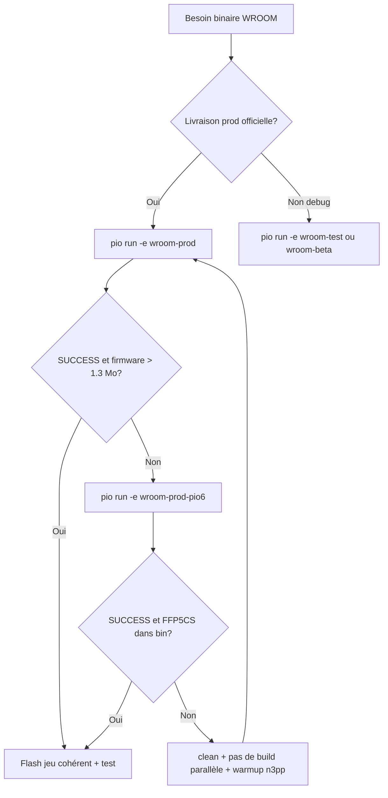

# Compilation FFP5CS — environnements, pioarduino et comparaison avec les autres firmwares

**Public** : développeurs et agents qui compilent ou flashent FFP5CS (WROOM / S3).  
**Complète** : [BUILD_S3_PROCESS_ANALYSE.md](BUILD_S3_PROCESS_ANALYSE.md) (famille S3), [WROOM_TASK_WDT_30S.md](WROOM_TASK_WDT_30S.md) (sdkconfig WROOM), [firmwires/README.md](../../../README.md) (scripts racine, redirection build Windows).

---

## 1. Vue d’ensemble : pourquoi FFP5CS est plus complexe que n3pp / msp

| Aspect | **n3pp**, **msp**, **uploadphotosserver** (`msp1` / `n3pp` / `ffp3`) | **FFP5CS WROOM** (`wroom-prod`, `wroom-test`, …) | **FFP5CS S3** (`wroom-s3-*`) |
|--------|------------------------------------------------------------------------|--------------------------------------------------|------------------------------|
| Plateforme WROOM | pioarduino **55.03.37** | pioarduino **55.03.37** (sauf secours) | `platformio/espressif32@6.13.0` |
| Arduino-ESP32 | **3.3.7** (tarball explicite ou via pioarduino) | **3.3.7** via `platform_packages` | **2.0.17** (bundlé plateforme 6.13) |
| ESP-IDF sous-jacent | **5.5.x** | **5.5.x** | **4.4.7** |
| Nombre d’envs | 1–3 par projet | **13+** (prod, test, beta, S3, PSRAM, USB, TLS test, …) | idem |
| Build en passes | 1 passe (sketch = `src/main.cpp` ou équivalent) | **2 passes** pioarduino (voir §3) | 2–3 passes (libs IDF + app) |
| `custom_sdkconfig` | rarement | **`sdkconfig_wroom_wdt.txt`** (CPU 240 MHz, pas SPIRAM, TWDT 30 s) | **`sdkconfig_s3_wdt.txt`** + patches S3 |
| Scripts pre/post | redirection build, patch ESP Mail | + `pio_restore_build_config.py`, `pio_save_boot_artifacts.py`, secrets, git-data, patches S3 conditionnels | + `clean_s3_build.ps1`, scripts S3 |
| Secrets | `firmwires/credentials.h` | **`include/secrets.h`** (propre au projet) | idem |
| Taille firmware typique | ~0,8–1,2 Mo | **~1,4–1,7 Mo** (prod/test) | variable (S3 + PSRAM plus lourd) |

Les firmwares **legacy simples** (un `main.cpp`, peu de libs, pas de `custom_sdkconfig`) compilent en une passe et échouent rarement sur des headers IDF manquants. **FFP5CS** active `custom_sdkconfig`, beaucoup de `lib_deps`, plusieurs tâches FreeRTOS et la chaîne **pioarduino** qui sépare compilation des libs IDF et compilation du sketch projet.

---

## 2. Matrice des environnements FFP5CS (rappel)

| Env | Plateforme | Usage | Livraison terrain |
|-----|------------|-------|-------------------|
| **wroom-prod** | pioarduino 55.03.37 | Production WROOM, DHT22, serial off | **Oui** (cible normale) |
| **wroom-prod-pio6** | espressif32 **6.13.0** | Secours build **1 passe** (Arduino 2.x) | Oui si binaire validé (même profil prod, TLS : voir §6) |
| **wroom-prod-https** | comme prod | Préparé ; **bloqué** en compile si TLS métier absent | Non (v13.81+) |
| **wroom-test** | pioarduino | Dev, logs, web async | Non |
| **wroom-beta** / **wroom-beta-local** | pioarduino | OTA test / Docker local | Non (sauf essais) |
| **wroom-s3-prod** / **wroom-s3-test** (+ variantes PSRAM) | espressif32 6.13.0 | Carte S3 N16R8 | prod S3 uniquement pour prod |

Détail des flags et partitions : commentaires en tête de `platformio.ini` et tableau dans [docs/README.md](../README.md).

---

## 3. Build pioarduino en deux phases (WROOM)

Applicable à **`wroom-prod`**, **`wroom-test`**, **`wroom-beta`**, etc. (tout env dont `platform` pointe vers la release pioarduino 55.03.37).

### Phase 1 — « Compile Arduino IDF libs »

- CMake/Ninja compilent les composants ESP-IDF + un sketch minimal **`.dummy/sketch.cpp`** (stubs `setup()` / `loop()` vides).
- Durée typique : **5–8 min** (premier build) ou moins si cache chaud.
- Produit : bibliothèques `.a`, `bootloader.bin`, `partitions.bin`, répertoire `config/` (dont `sdkconfig.h`).

### Post-action `idf_lib_copy`

- Copie des libs vers le cache plateforme, puis **`rmtree(BUILD_DIR)`** et **relance** `pio run` → phase 2.

### Phase 2 — compilation `src/app.cpp` et du projet

- Doit retrouver les includes Arduino/IDF (`Arduino.h`, `sdkconfig.h`, `FreeRTOSConfig.h`, …).
- Scripts du projet :
  - **`tools/pio_save_boot_artifacts.py`** (pre `checkprogsize`) : copie `bootloader.bin`, `partitions.bin`, `ota_data_initial.bin`, `config/` vers **`.pio_artifacts/<env>/`** avant le `rmtree`.
  - **`tools/pio_restore_build_config.py`** : restaure `config/` au début de la phase 2 si `CMakeCache.txt` absent.

### Symptômes d’échec phase 2

| Symptôme | Cause probable | Action |
|----------|----------------|--------|
| `Arduino.h: No such file or directory` | Phase 2 sans chemins framework / `config/` perdu | Vérifier restauration `.pio_artifacts/<env>/config` ; `pio run -e <env> -t clean` puis rebuild **sans** interrompre |
| SUCCESS mais `firmware.bin` **~780–820 Ko** | Seule la phase 1 (stub `.dummy`) a été liée | **Ne pas flasher** ; chercher absence de `src/app.cpp.o` dans le build dir |
| SUCCESS avec « Hello World » dans le binaire | Idem (stub) | Ne pas flasher |
| `firmware.bin` **> 1,3 Mo**, chaîne `FFP5CS` présente | Build application OK | Flash + test série (§7) |
| Build s’arrête très tôt (~15 s) après « config restauré » | Ancien bug `SystemExit(0)` dans restore (corrigé) | Mettre à jour `pio_restore_build_config.py` du dépôt |

### Tentative `#include "../src/app.cpp"` dans `.dummy/sketch.cpp`

Compile une partie du code en phase 1 mais **échoue au link** (autres `.cpp` de `src/` non liés). **Ne pas utiliser** comme solution durable ; garder les stubs dans `.dummy/sketch.cpp`.

---

## 4. Environnement de secours : `wroom-prod-pio6`

```ini
[env:wroom-prod-pio6]
extends = env:wroom-prod
platform = platformio/espressif32@6.13.0
```

| | **wroom-prod** (pioarduino) | **wroom-prod-pio6** |
|--|----------------------------|---------------------|
| Passes | 2 | **1** (classique PlatformIO) |
| Arduino-ESP32 | 3.3.7 | **2.0.17** (bundlé) |
| Durée build | long (phase 1 + 2) | ~1–2 min (incrémental) |
| Alignement OTA / IDF 5 | oui | **non** — à valider sur carte avant prod |
| Symbole TLS OTA | `esp_crt_bundle_attach` | `arduino_esp_crt_bundle_attach` (voir `ota_manager.cpp`, sélection par `ESP_ARDUINO_VERSION_MAJOR`) |

**Quand l’utiliser**

- Phase 2 pioarduino bloquée en local (headers manquants, cache corrompu).
- Besoin urgent d’un binaire **prod** pour test hardware (boot, WDT, capteurs).
- CI de secours si le job `wroom-prod` est rouge.

**Commande**

```powershell
cd firmwires\ffp5cs
$env:PYTHONUTF8 = "1"
pio run -e wroom-prod-pio6
```

Artefacts : `.pio/build/wroom-prod-pio6/` ou `C:\pio-builds\ffp5cs\wroom-prod-pio6\` si redirection Windows active.

---

## 5. Tutoriel : éviter les problèmes (bonnes pratiques)

### 5.1 Avant le premier build

1. Copier **`include/secrets.h.example`** → **`include/secrets.h`** (non versionné).
2. Installer PlatformIO 6.x ; prévoir **~500 Mo** pour le premier téléchargement pioarduino.
3. Sous Windows : laisser la redirection vers **`C:\pio-builds\ffp5cs\<env>\`** active (défaut via `firmwires/scripts/pio_redirect_build_dir.py`).

### 5.2 Pendant le build

1. **Ne pas lancer deux builds pioarduino** (ffp5cs + n3pp + msp) **en parallèle** — risque de verrouillage cache (`WinError 32/183`, `FRAMEWORK_DIR None`).
2. **Ne pas interrompre** un build WROOM pioarduino pendant la phase 1 (attendre « Compile Arduino IDF libs » terminé).
3. Après un build **S3**, avant un build **WROOM** : `pio run -e <env_wroom> -t clean` (ou utiliser `scripts/build_all_envs.ps1` qui alterne les familles).
4. Pour **wroom-beta** seul en échec : lancer d’abord **`pio run -e wroom-prod`** une fois avec succès, puis `wroom-beta` ([BUILD_S3_PROCESS_ANALYSE.md](BUILD_S3_PROCESS_ANALYSE.md) § wroom-beta).

### 5.3 Vérifier que le build est exploitable

```powershell
$bd = ".pio\build\wroom-prod"
if (Test-Path "C:\pio-builds\ffp5cs\wroom-prod\firmware.bin") { $bd = "C:\pio-builds\ffp5cs\wroom-prod" }
(Get-Item "$bd\firmware.bin").Length   # attendu : > 1_300_000 pour FFP5CS complet
Test-Path "$bd\src\app.cpp.o"          # doit être True (pioarduino phase 2 OK)
```

Contrôle optionnel de la chaîne dans le binaire :

```powershell
$t = [Text.Encoding]::ASCII.GetString([IO.File]::ReadAllBytes("$bd\firmware.bin"))
$t -match 'FFP5CS'    # True
$t -match 'Hello World'  # False
```

### 5.4 Build `wroom-beta-local` (tests Docker)

Env dédié aux tests contre le serveur local : `USE_LOCAL_SERVER_ENDPOINTS` + `include/local_server_overrides.h`. Même chaîne **pioarduino 2 passes** que `wroom-beta`.

1. Prérequis : `secrets.h`, `local_server_overrides.h`, stack Docker (`serveur/tools/local-docker.ps1`).
2. Si premier build de la session : **warmup** `cd firmwires\n3pp` → `pio run -e esp32dev` (évite `FRAMEWORK_DIR None`).
3. `pio run -e wroom-beta-local` — valider `firmware.bin` **~1,55–1,65 Mo** et `src\app.cpp.o` sous **`.pio\build\wroom-beta-local\`** (ne pas réutiliser un vieux `C:\pio-builds\...` si la version/taille diverge).
4. Flash, campagne de tests, CP210x : guide complet **[WROOM_BETA_LOCAL_BUILD_FLASH_TEST.md](WROOM_BETA_LOCAL_BUILD_FLASH_TEST.md)**.

### 5.5 Recovery Windows (cache plateforme)

1. Fermer IDE, moniteurs série, terminaux PlatformIO.
2. Warmup sur un firmware WROOM simple : `cd firmwires\n3pp` → `pio run -e esp32dev`.
3. Revenir sur ffp5cs : `pio run -e wroom-test -t clean` puis `pio run -e wroom-test`.
4. Si besoin : nettoyer `C:\pio-builds\ffp5cs\<env>`, `.pio\build\<env>`, et relancer.
5. Dernier recours prod : **`pio run -e wroom-prod-pio6`**.

Voir aussi [firmwires/README.md](../../../README.md) § « Recovery PlatformIO Windows ».

---

## 6. Erreurs de compilation fréquentes et correctifs

| Erreur / message | Contexte | Piste de résolution |
|------------------|----------|---------------------|
| `esp_crt_bundle_attach was not declared` | **wroom-prod-pio6** (Arduino 2.x) | Déjà géré dans `ota_manager.cpp` : Arduino &lt; 3 → `arduino_esp_crt_bundle_attach` |
| `undefined reference to __atomic_fetch_add_4` | n3pp/msp/cam avec GCC 14 | `src/gcc_atomic_compat.c` (pas nécessaire sur ffp5cs pio6 classique) |
| `FRAMEWORK_DIR` / `_path_exists` **NoneType** | Cache pioarduino corrompu | §5.5 ; warmup **`n3pp`** ou build `wroom-prod` avant `wroom-beta` / `wroom-beta-local` |
| `secrets.h: No such file` | secrets manquants | Copier `include/secrets.h.example` |
| `USE_HTTPS_ENDPOINTS` + erreur compile | prod-https | Normal (garde-fou v13.81) — utiliser HTTP prod ou implémenter TLS métier |
| Échec link S3 « gap » / ldgen | wroom-s3-* | [BUILD_S3_PROCESS_ANALYSE.md](BUILD_S3_PROCESS_ANALYSE.md), `clean_s3_build.ps1` |
| Chemin trop long / espace dans le clone | Windows | Redirection `C:\pio-builds` ; S3 : `run_s3_build_from_safe_path.bat` |
| `WiFi.cpp.o: No such file` après bascule WROOM↔S3 | Cache mixte | `pio run -e <env> -t clean` sur l’env cible |

---

## 7. Flash : jeu cohérent et panic « Cache error »

### Règle d’or

Toujours flasher **bootloader + partitions + (otadata si présent) + firmware** issus du **même** répertoire de build et du **même** env.

Mélanger un `firmware.bin` OTA (autre sdkconfig) avec un bootloader d’un autre build provoque des boots invalides (ex. **Guru Meditation « Cache error »** dans `esp_flash_init`).

**Cause fréquente (2026-06)** : `firmware.bin` **&lt; 1,2 Mo** (~800 Ko) = build pioarduino **incomplet** (phase 1) flashé par erreur → boot loop immédiat. Garde-fous : `tools/pio_verify_wroom_sdkconfig.py` (post-build), `tools/verify_wroom_sdkconfig.ps1`, `tools/verify_flash_bundle.ps1`.

**Jonction Windows** : après `pio run -t clean`, réparer via `pio_repair_build_junction.py` ou `Repair-N3PioBuildJunction` ; le workflow erase n’utilise plus clean par défaut (`-FullClean` pour recovery).

### sdkconfig WROOM (`sdkconfig_wroom_wdt.txt`)

Correctifs boot documentés : CPU **240 MHz** cohérent, **PSRAM désactivé** sur WROOM 4 Mo, pas de `SPIRAM_CACHE_WORKAROUND`, coredump désactivé, bundle TLS CMN. **Ne pas** flasher un firmware compilé avec un ancien sdkconfig Tasmota-like (SPIRAM activé sans puce).

### Procédure flash manuelle (esptool)

```powershell
cd firmwires\ffp5cs
. .\scripts\Release-ComPort.ps1
Release-ComPortIfNeeded -Port COM4
$bd = ".pio\build\wroom-prod-pio6"   # ou wroom-prod, ou C:\pio-builds\ffp5cs\...
$py = "$env:USERPROFILE\.platformio\penv\Scripts\python.exe"
$esptool = "$env:USERPROFILE\.platformio\packages\tool-esptoolpy\esptool.py"
& $py $esptool --chip esp32 --port COM4 --baud 460800 erase_flash
& $py $esptool --chip esp32 --port COM4 --baud 460800 write_flash `
  0x1000 "$bd\bootloader.bin" `
  0x8000 "$bd\partitions.bin" `
  0x10000 "$bd\firmware.bin"
```

Si `ota_data_initial.bin` existe (build OTA) : ajouter `0xe000` avec ce fichier.

Alternative : `pio run -e wroom-prod -t upload --upload-port COM4` (vérifie quand même la taille du `firmware.bin` généré).

### CP210x et `Wrong boot mode detected (0x13)`

Certaines cartes (pont **Silicon Labs CP210x** sans liaison DTR→GPIO0) ne passent pas en mode téléchargement avec le reset automatique de `pio run -t upload`.

| Message | Signification |
|---------|----------------|
| `Wrong boot mode detected (0x13)` | La puce exécute déjà le firmware (SPI_FAST_FLASH_BOOT), pas le stub de flash |
| `No serial data received` | Port libre mais pas en mode boot |
| `Lost connection` pendant `write_flash` | Câble/USB instable — rebrancher, relancer l’écriture (éventuellement erase + flash complet) |

**Contournement** : procédure **BOOT + RST** manuelle puis esptool `--before no_reset` (détail et exemple COM5 dans [WROOM_BETA_LOCAL_BUILD_FLASH_TEST.md](WROOM_BETA_LOCAL_BUILD_FLASH_TEST.md) §3.3).

### Répertoire d’artefacts après build

Sous Windows, la redirection `C:\pio-builds\ffp5cs\<env>\` peut contenir un binaire **plus ancien** que `.pio\build\<env>\` si le dernier `pio run` a écrit surtout sous `.pio`. Avant flash, comparer `version.txt` et la taille de `firmware.bin` ; **privilégier le dossier du build qui vient de réussir**.

### Après flash prod

- **`ENABLE_SERIAL_MONITOR=0`** : peu de logs UART ; utiliser **`wroom-test`** ou **`wroom-beta`** pour diagnostic série.
- Workflow référence : `erase_flash_fs_monitor_5min_analyze.ps1` (vérifie sdkconfig avant flash ; pas de clean sauf `-FullClean`) ([INVENTAIRE_SCRIPTS_FFP5CS.md](../../INVENTAIRE_SCRIPTS_FFP5CS.md)).
- Build rapide alternance projets : `firmwires/scripts/Invoke-PioBuildFast.ps1 -Project ffp5cs -Environment wroom-prod -Verify`.

---

## 8. Arbre de décision rapide



---

## 9. Scripts et fichiers utiles

| Fichier | Rôle |
|---------|------|
| `platformio.ini` | Matrice des envs, flags prod/test |
| `.dummy/sketch.cpp` | Stubs phase 1 pioarduino |
| `sdkconfig_wroom_wdt.txt` | Overrides sdkconfig WROOM |
| `tools/pio_save_boot_artifacts.py` | Sauvegarde avant `rmtree` |
| `tools/pio_restore_build_config.py` | Restaure `config/` phase 2 |
| `scripts/build_all_envs.ps1` | Build séquentiel (évite parallèle pioarduino) |
| `scripts/Release-ComPort.ps1` | Libère COM avant flash |
| `.pio_artifacts/<env>/` | Bootloader/partitions sauvegardés |
| `build_upload_monitor_wroom_beta_local.ps1` | Build + upload + monitor beta-local (`-Port COMx`) |
| [WROOM_BETA_LOCAL_BUILD_FLASH_TEST.md](WROOM_BETA_LOCAL_BUILD_FLASH_TEST.md) | Build / flash / tests Docker beta-local |

---

## 10. Pistes d’évolution (maintenance)

- **Stabiliser phase 2 pioarduino** : garantir les include paths `framework-espidf` après `idf_lib_copy` (comparer `compile_commands.json` d’un build `wroom-beta` historique réussi vs échec actuel).
- **Réaligner `wroom-prod-pio6` sur pioarduino** à terme pour un seul toolchain prod (IDF 5 + Arduino 3.3.7).
- **CI** : job `wroom-prod` obligatoire ; job `wroom-prod-pio6` en secours ou nightly.

---

*Dernière mise à jour : 2026-06 — v13.84, `wroom-prod-pio6`, `wroom-beta-local` (warmup n3pp, flash CP210x), scripts `.pio_artifacts`.*
